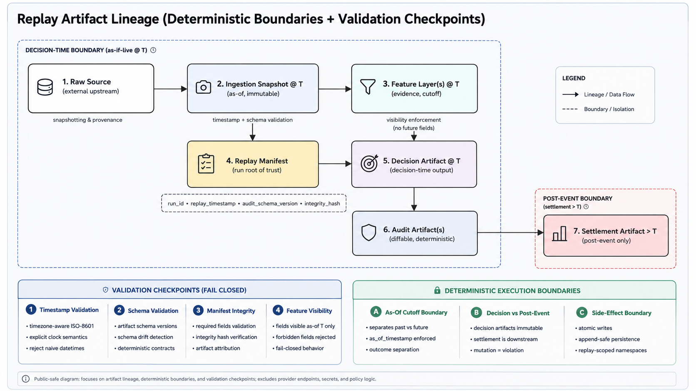

# Lilith Architecture


---

## Overview

The core design principle of Lilith is simple:

> a historical replay should behave exactly as if the system were operating live at that point in time — without access to future information, hidden corrections or post-event state.

Lilith treats replayability, auditability and temporal correctness as first-class engineering constraints rather than secondary validation steps.

Lilith is a replayable, event-driven decision system built primarily as a learning and validation project.

What started as a small football modelling experiment slowly evolved into a larger software engineering and governance-oriented platform focused on:

- replay infrastructure
- deterministic execution
- time-safe validation
- calibration pipelines
- governance layers
- fail-closed architecture
- shadow deployment flows
- staged rollout logic
- audit and recovery tooling

This repository contains the public-safe architecture and research notes behind the project.

The goal is not to expose a “winning model,” but to document:

- engineering structure
- replay methodology
- validation philosophy
- governance concepts
- architectural trade-offs
- lessons learned while building the system

Most production logic, thresholds, deployment configurations, calibrated artifacts and private datasets are intentionally excluded.

---

## Contents

- [Why I Built This](#why-i-built-this)
- [Current Focus](#current-focus)
- [Engineering Priorities](#engineering-priorities)
- [Replay Infrastructure](#replay-infrastructure)
- [Replay Determinism](#replay-determinism)
- [Replay Artifact Lineage](#replay-artifact-lineage)
- [Public Utilities](#public-utilities)
- [Repository Structure](#repository-structure)
- [Documentation](#documentation)
- [Public-Safe Philosophy](#public-safe-philosophy)
- [Project Status](#project-status)

---

## Why I Built This

This is my first serious software engineering project.

I started with very limited programming experience and used the project as a way to learn:

- orchestration
- replay pipelines
- probabilistic systems
- temporal validation
- governance patterns
- audit tooling
- fail-safe system design
- large-scale project organization

Over time, the project became much larger than originally expected and evolved into a multi-stage experimental platform.

Because this is my first large-scale project, the repository also reflects the learning process itself:

- mistakes
- refactors
- architectural redesigns
- overengineering trade-offs
- validation challenges

---

## Current Focus

The current research focus is centered around:

- replayable season-by-season evaluation
- event-first modelling
- anti-leakage validation
- calibration stability
- governance and safety layers
- deployment architecture
- deterministic replay execution
- shadow/live comparison systems

---

## Engineering Priorities

The project currently prioritizes:

1. Temporal correctness over convenience
2. Replayability over opaque execution
3. Auditability over minimal output
4. Fail-closed behavior over silent degradation
5. Deterministic validation over optimistic assumptions

The goal is not maximum complexity, but controlled and explainable system behavior.

---

## Replay Infrastructure

The project is built around replayable “as-if-live” execution cycles.

Replay runs are designed to:

- enforce temporal correctness
- prevent future-data leakage
- emit deterministic audit artifacts
- validate governance and fail-closed constraints
- preserve replay reproducibility
- support audit-oriented debugging workflows

Additional deep-dive technical notes:

- [`docs/replay_determinism.md`](docs/replay_determinism.md)
- [`docs/replay_artifact_lineage.md`](docs/replay_artifact_lineage.md)

### Example Replay Run


### Validation & Anti-Leakage Checks


### Orchestration Flow


### Audit Artifact Structure


### Workspace Structure (Public-Safe)


---

## Replay Determinism

The replay subsystem is designed around deterministic “as-if-live” execution guarantees.

The design note in `docs/replay_determinism.md` documents:

- replay invariants
- immutable replay timestamps
- deterministic execution boundaries
- fail-closed replay validation
- temporal isolation guarantees
- replay reproducibility vs audit reproducibility
- replay abort mechanics
- artifact lineage philosophy

One of the central design assumptions is:

> future information is an adversary and non-determinism is an integrity failure.

The replay design note intentionally focuses on:

- failure modes
- invariant enforcement
- auditability
- replay correctness
- engineering trade-offs

rather than prediction quality or profitability claims.

---

## Replay Artifact Lineage

The replay lineage subsystem documents how replay artifacts move through deterministic execution boundaries.

The design note in `docs/replay_artifact_lineage.md` defines:

- artifact classes
- immutable replay boundaries
- validation checkpoints
- deterministic write guarantees
- replay provenance contracts
- audit lineage semantics
- fail-closed replay integrity boundaries

### Replay Lineage Diagram



The lineage architecture separates:

- decision-time artifacts
- replay manifests
- evidence layers
- audit artifacts
- post-event settlement artifacts

while preserving deterministic replay guarantees and temporal isolation constraints.

The lineage design intentionally focuses on:

- replay correctness
- deterministic boundaries
- immutable artifacts
- validation checkpoints
- audit-oriented reproducibility

rather than model outputs or operational strategies.

---

## Public Utilities

The repository also includes small public-safe utilities focused on replayability, validation and governance concepts.

### Replay Manifest Validator

Location:

`scripts_public/replay_manifest_validator.py`

Purpose:

- validate replay manifests
- enforce schema consistency
- validate replay timestamps
- support deterministic replay workflows
- demonstrate audit-oriented validation patterns

Example usage:

`python scripts_public/replay_manifest_validator.py path/to/replay_manifest.json`

Example stdin usage:

`Get-Content path/to/replay_manifest.json | python scripts_public/replay_manifest_validator.py -`

### Example Replay Manifest

Minimal public-safe replay manifest example used for deterministic replay validation:

```json
{
  "run_id": "2026_05_26_REPLAY",
  "replay_timestamp": "2026-05-26T10:00:00Z",
  "fixtures_processed": 142,
  "audit_schema_version": "v1",
  "integrity_hash": "abc123"
}
```

---

## Repository Structure

```text
README.md
/docs
/images
/examples
/scripts_public
```

### Main Areas

- `/docs`
  Technical architecture and governance notes

- `/images`
  Replay, orchestration and validation screenshots and diagrams

- `/examples`
  Public-safe replay and audit examples

- `/scripts_public`
  Lightweight public-safe validation utilities

---

## Documentation

Additional technical notes are available in the `/docs` folder:

- `architecture.md`
- `replay_engine.md`
- `replay_determinism.md`
- `replay_artifact_lineage.md`
- `governance.md`
- `anti_leakage.md`
- `calibration.md`

---

## Public-Safe Philosophy

This repository intentionally avoids exposing:

- private datasets
- deployment secrets
- provider credentials
- production thresholds
- final selection logic
- operational endpoints
- calibrated production artifacts

The focus of this repository is software engineering, validation, replayability, governance and auditability.

---

## Project Status

This project is currently under active development and continuous architectural iteration.
