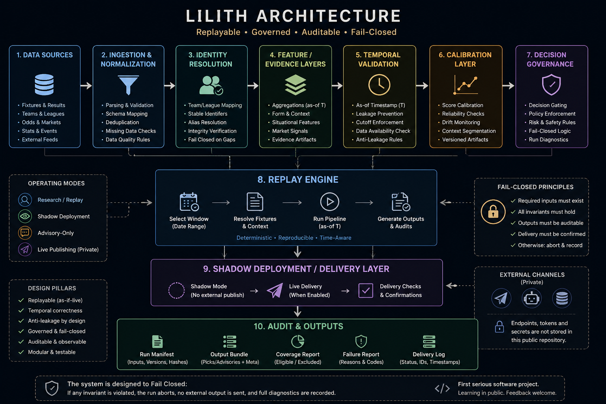
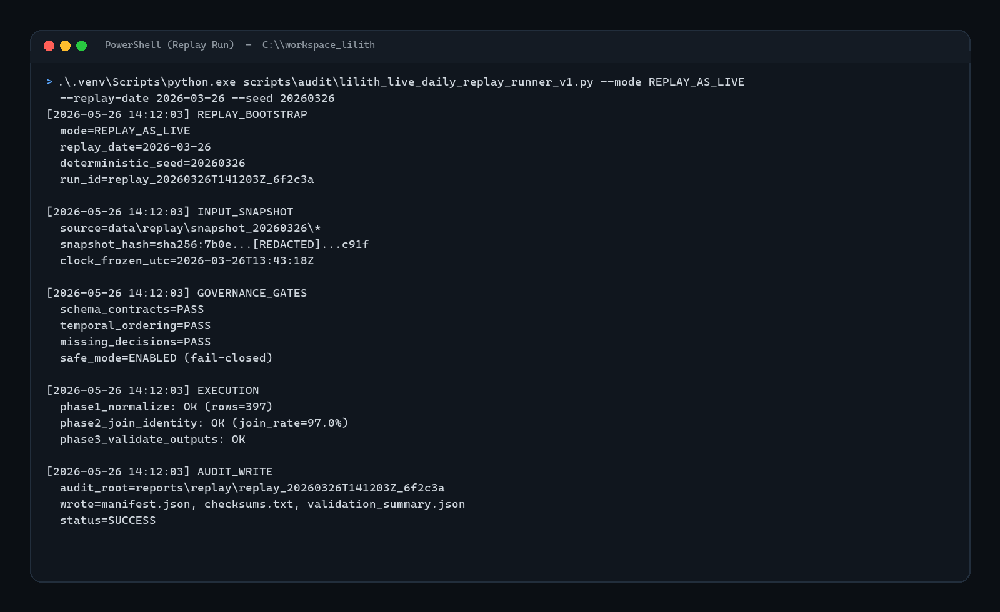
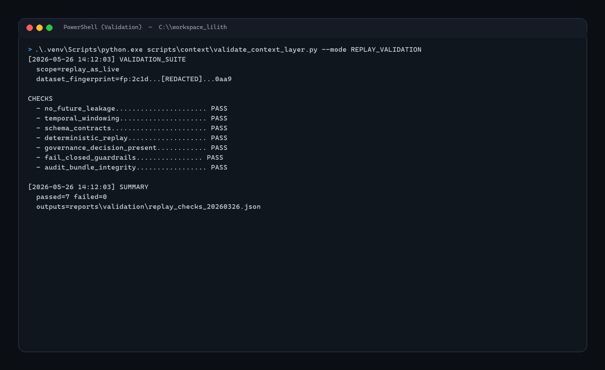
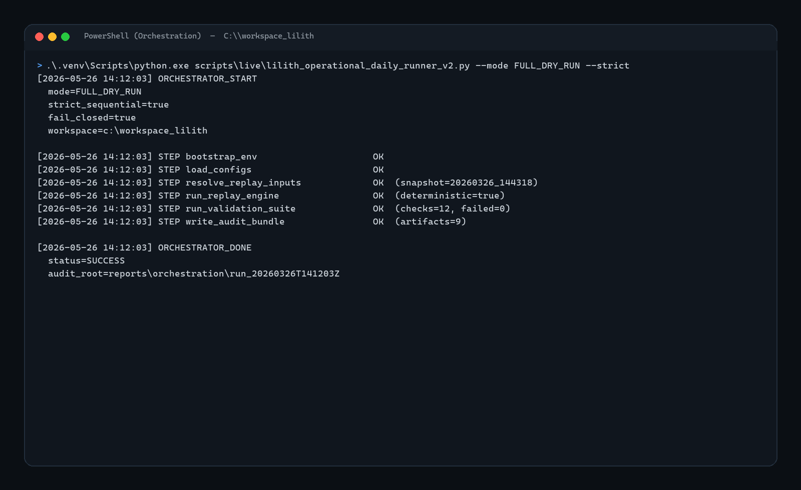
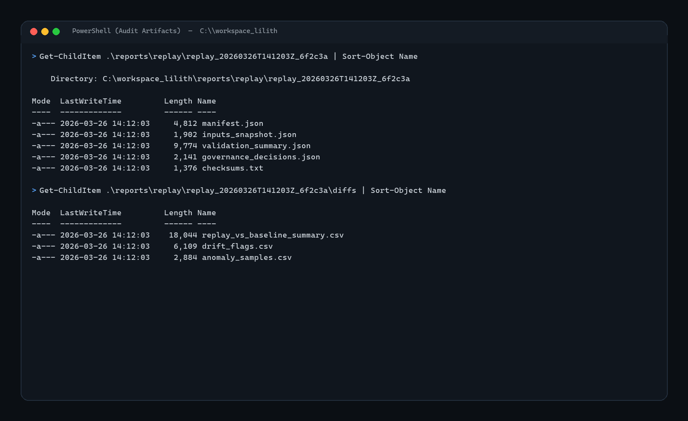
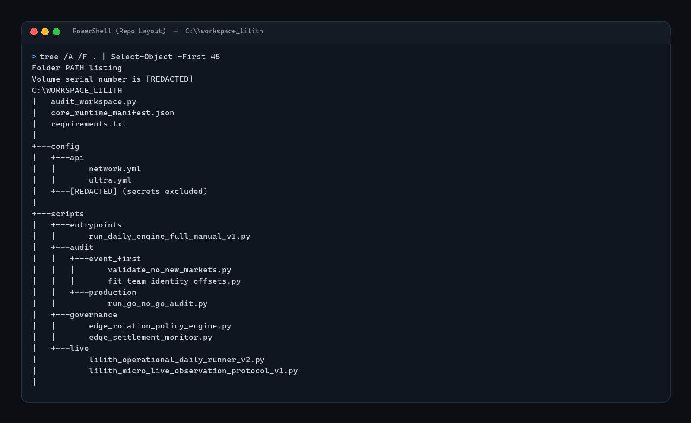

# Lilith Architecture

## Overview

Lilith is a replayable, event-driven decision system built primarily as a learning and validation project.

What started as a small football modelling experiment slowly evolved into a larger software engineering and governance-oriented platform focused on:

- replay infrastructure
- time-safe validation
- calibration pipelines
- governance layers
- fail-closed architecture
- shadow deployment flows
- staged rollout logic
- audit and recovery tooling

This repository contains the public-safe architecture and research notes behind the project.

The goal is not to expose a “winning model,” but to document:
- engineering structure
- replay methodology
- validation philosophy
- governance concepts
- architectural trade-offs
- lessons learned while building the system

Most production logic, thresholds, deployment configurations, calibrated artifacts, and private datasets are intentionally excluded.

---

## Contents

- [Why I Built This](#why-i-built-this)
- [Current Focus](#current-focus)
- [Replay Infrastructure](#replay-infrastructure)
- [Repository Scope](#repository-scope)
- [Documentation](#documentation)

---

## Why I Built This

This is my first serious software engineering project.

I started with very limited programming experience and used the project as a way to learn:

- orchestration
- replay pipelines
- probabilistic systems
- temporal validation
- governance patterns
- audit tooling
- fail-safe system design
- large-scale project organization

Over time, the project became much larger than originally expected and evolved into a multi-stage experimental platform.

Because this is my first large-scale project, the repository also reflects the learning process itself:
- mistakes
- refactors
- architectural redesigns
- overengineering trade-offs
- validation challenges

---

## Current Focus

The current research focus is centered around:

- replayable season-by-season evaluation
- event-first modelling
- anti-leakage validation
- calibration stability
- governance and safety layers
- deployment architecture
- deterministic replay execution
- shadow/live comparison systems

---

## Replay Infrastructure

The project is built around replayable “as-if-live” execution cycles.

Replay runs are designed to:
- enforce temporal correctness
- prevent future-data leakage
- emit deterministic audit artifacts
- validate governance and fail-closed constraints

### Example Replay Run

### Validation & Anti-Leakage Checks

### Orchestration Flow

### Audit Artifact Structure

### Workspace Structure (Public-Safe)

---

## Repository Scope

This public repository mainly contains:

- architecture notes
- governance concepts
- replay methodology
- validation philosophy
- simplified examples
- documentation and experiments

The private production environment remains intentionally separated.

---

## Documentation

Additional technical notes are available in the `/docs` folder:

- `architecture.md`
- `replay_engine.md`
- `governance.md`
- `anti_leakage.md`
- `calibration.md`

---

## Public-Safe Philosophy

This repository intentionally avoids exposing:

- private datasets
- deployment secrets
- provider credentials
- production thresholds
- final selection logic
- operational endpoints
- calibrated production artifacts

The focus of this repository is software engineering, validation, replayability, governance, and auditability.
