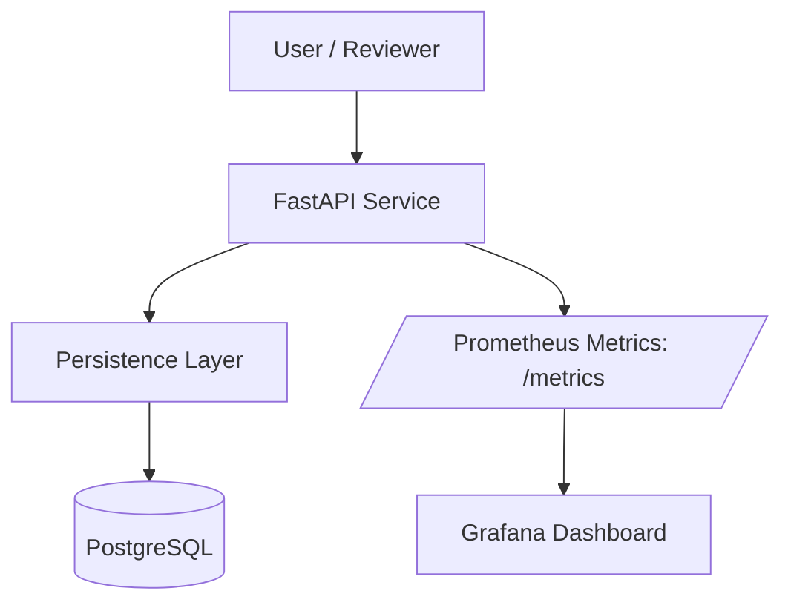

# System Topology (Public)

This page provides a fast mental model for how the deployed system fits together.

## Topology Diagram

## Component Roles

- **FastAPI Service**
  - Exposes the public API (Swagger/OpenAPI, health endpoints, replay/persistence endpoints).
  - Emits metrics for every request and for key workflow events (replay creation, lineage reads, DB operations).

- **Persistence Layer**
  - Performs transactional writes/reads for replay runs and artifact records.
  - Produces lineage views from persisted records.

- **PostgreSQL**
  - Stores replay runs and artifact records.
  - Schema is managed by Alembic migrations.

- **Prometheus Metrics**
  - Exposes a scrape endpoint (`/metrics`) so the system is observable from the outside.
  - Metrics are intentionally designed to avoid high-cardinality labels.

- **Grafana Dashboard**
  - Visualizes request rates/latency and DB/replay/lineage metrics.
  - Dashboard JSON is versioned in the repo for reproducibility.

